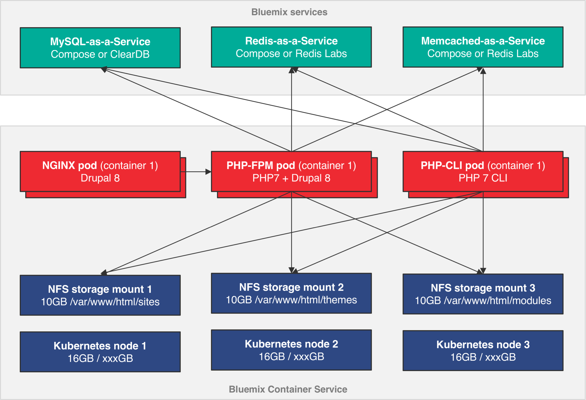
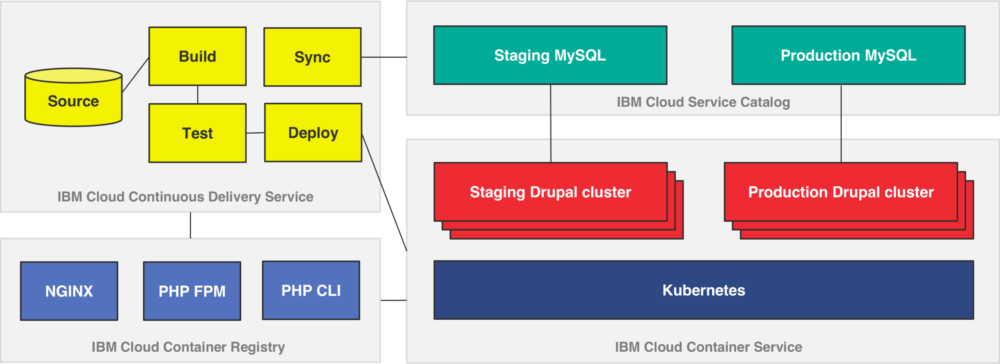

# NGINX, PHP-FPM, and Drupal deployment on the IBM Cloud
This project shows how to deploy a [Drupal 8](https://www.drupal.org/docs/8/) environment on a cluster of NGINX and PHP containers using the [IBM Container Service](https://www.ibm.com/cloud-computing/bluemix/containers) and several Cloud catalog services.

These containers mount a persistent volume for sites (which change after build and deployment time) and connect to [MySQL, Redis, and Memcached services from the IBM Cloud catalog](https://console.bluemix.net/catalog/?env_id=ibm%3Ayp%3Aus-south&category=data) (not self-hosted containers inside the same cluster).

After deployment, Drupal developers (who are the end users of the cluster) can manage site lifecycle by delivering configuration or code changes to specific folders ([config](/tree/master/config), [code](/tree/master/code)) in this repository. Commits trigger fresh rebuild and deploys in an [IBM Continuous Delivery](https://console.bluemix.net/catalog/services/continuous-delivery/?taxonomyNavigation=services&cm_mc_uid=36647820015315082453960&cm_mc_sid_50200000=1509381998&env_id=ibm%3Ayp%3Aus-south) pipeline.

## What makes the
- A secure, high-performance, [IBM Container Service cluster](https://console.bluemix.net/docs/containers/cs_planning.html#cs_planning) (based on Kubernetes) with advanced network and storage configuration options.
- Integration with managed MySQL, Redis, and Memcached Databases-as-a-service provided through the Bluemix service catalog.
- [Multiple levels of security](https://console.bluemix.net/docs/containers/cs_security.html#cs_security) for Docker images stored in the IBM Container Registry, including automatic scanning by the [IBM Vulnerability Advisor](https://www.ibm.com/blogs/bluemix/2017/03/assessing-security-risk-containers-vulnerability-advisor/).
- Automatic build and deploy workflows with the [IBM Continuous Delivery Service](https://console.bluemix.net/catalog/services/continuous-delivery/?taxonomyNavigation=services&cm_mc_uid=36647820015315082453960&cm_mc_sid_50200000=1509381998&env_id=ibm%3Ayp%3Aus-south) (formerly IBM DevOps Services).

## Logical overview diagram
There are two separate Drupal installations that are deployed onto the container cluster. One to represent a "staging" environment and one to represent a "production" environment. Each has its own dedicated services and volume mounts. A CLI container can run `drush` or scripts such as `transfer-files.sh` and `transfer-data.sh` on those environments to synchronize them.

## Landscape diagram of the services used
When custom code is checked into this repository, it triggers a Docker image build which stores the images into a private container registry that analyzes the security of the images. These images are then rolled out across the Kubernetes cluster through staging and production gates. Data from production can be synchronized back to staging to ensure the environments are as close as possible.

## Setup the proof of concept

### One time Container Service and Bluemix services setup
See the Container Service Kubernetes and Bluemix services (MySQL, Redis, Memcached) [configuration instructions](docs/INITIAL-SETUP.md).

### Building and deploying the first set of containers
See the Docker container build and Kubernetes deployment [instructions](docs/DEPLOY-CONTAINERS.md).

### Ongoing development and operations with GitHub commits
See the ongoing development [instructions](docs/ONGOING-DEVELOPMENT.md). And the work in progress DevOps [pipeline docs](docs/PIPELINE-SETUP.md).

### Synchronizing data from production back to staging
There are two synchronization scripts that can be invoked to bring user generated changes to files or data from production back into the staging environment.
