## Provision a Kubernetes cluster on the IBM Bluemix Container Service
- Create a paid Bluemix account, and log into the Bluemix dashboard.
- Choose Containers from the left hand hamburger navigation.

    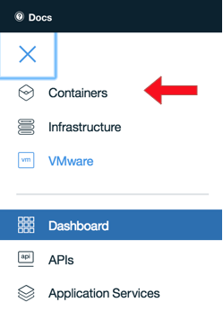

- Click the Create cluster button.

    

- Select the Standard type of cluster (this allows for storage volumes) and Create.

    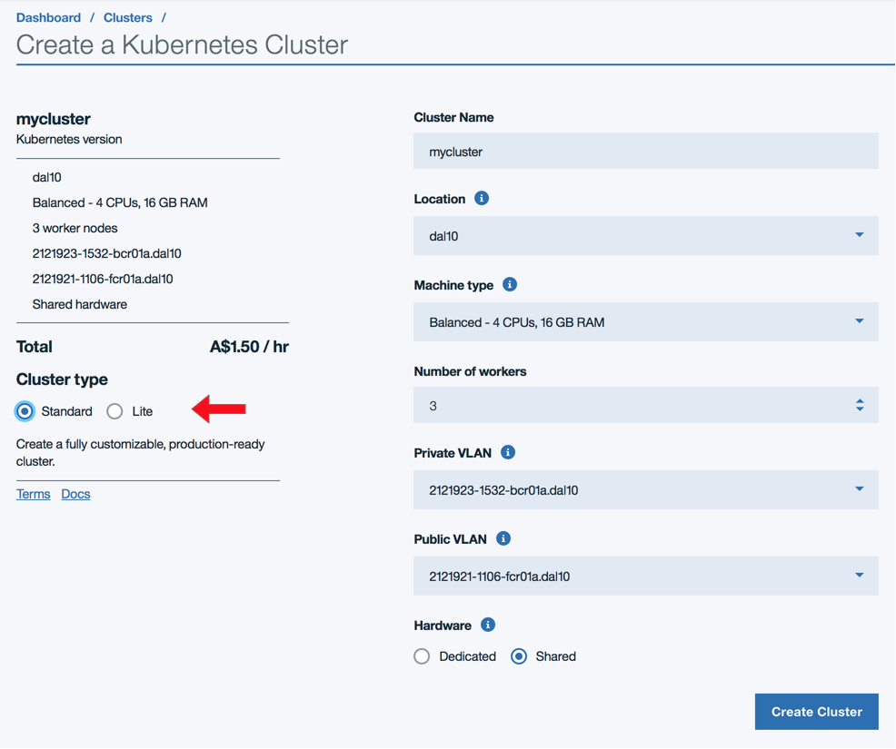

- Going back to the Dashboard from the navigation, you'll see your cluster.

- Click on it to see the cluster Overview.

    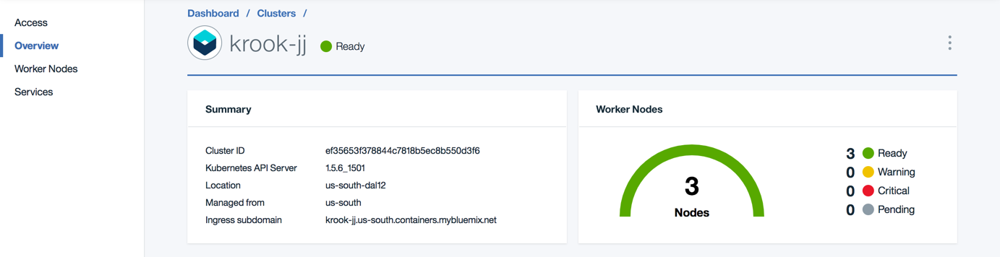

- Click on Worker Nodes to get details on your worker nodes.

    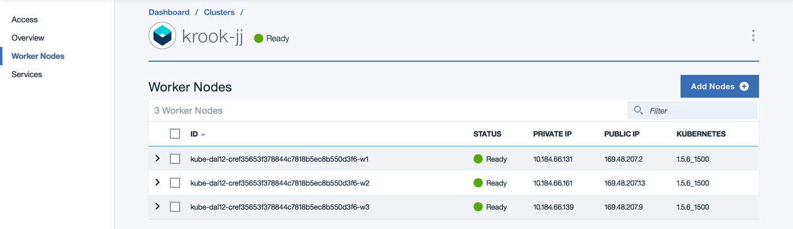

- It will take time for the cluster to complete provisioning, so go get some coffee.

## Connect to your Kubernetes cluster from your workstation
- Click on the Access link to download and configure the `bx` and `kubectl` CLIs. Kubectl version >=1.7.6 is required.

    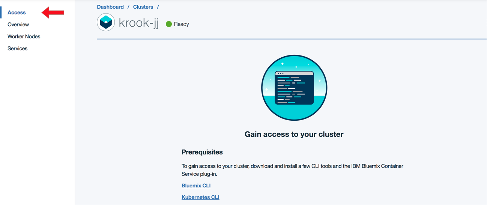

- Run the configuration commands, making sure that the `$KUBECONFIG` variable path is indeed correct (it may not reflect your actual home directory).
- You can then use `kubectl` or the `kubectl proxy` dashboard web UI that starts on localhost to inspect your Kubernetes environment.

## Provision and bind a MySQL-as-a-Service
- You can do this with the `bx` command too, but I prefer to work with the dashboard as it's a one time setup operation with several options.
- Go to the hamburger navigation again and choose Data & Analytics.

    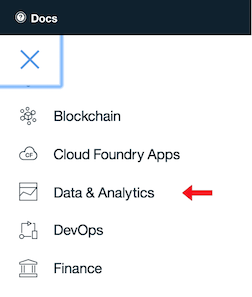

- Click "Create"

    

- You have a choice of two MySQL-as-a-Service providers, Compose and ClearDB. Compose is the preferred option, but ClearDB is quicker to get running with for a PoC.

    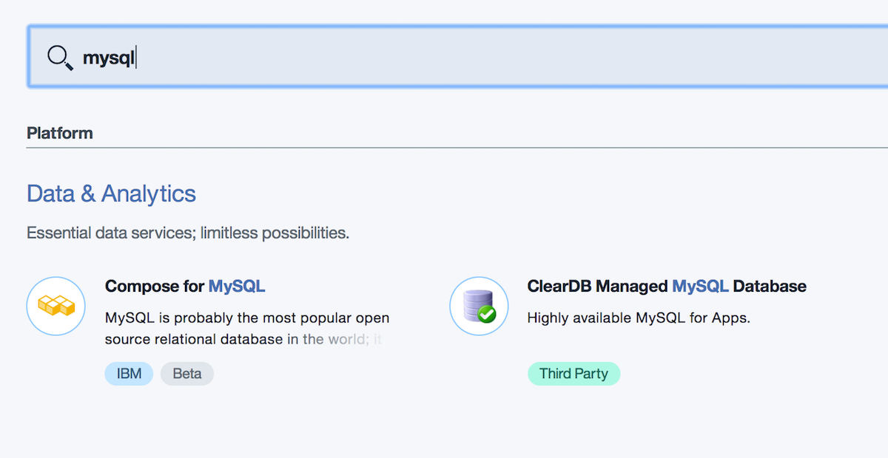

- Take note of the credentials, and save them in a `scripts/kubernetes/secrets/service-credentials.txt` file you copy from [`scripts/kubernetes/secrets/service-credentials.txt.tpl`](../scripts/kubernetes/secrets/service-credentials.txt.tpl).

For compose, the credentials will be shown right before you create the service.
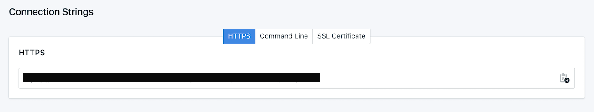

For ClearDB, the credentials can be found in the ClearDB Dashboard. Select your database and click the "System Information" tab
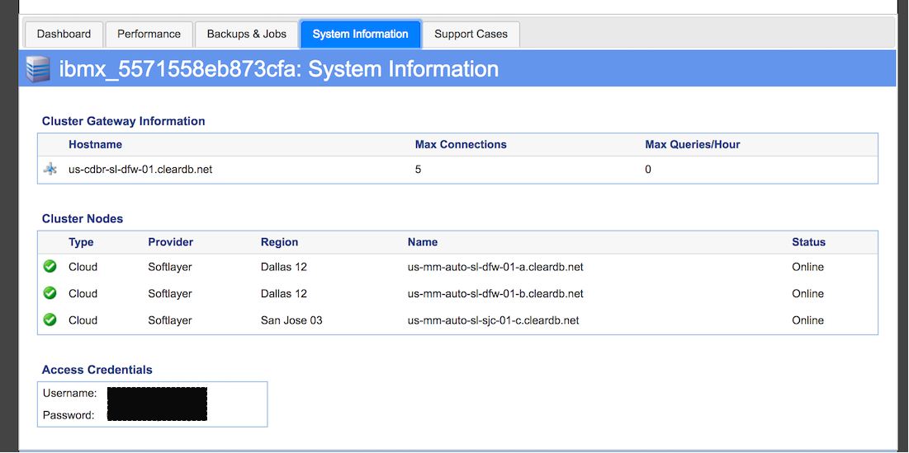

- The Bluemix Container Service offers a way to autobind credentials, but using a secret from this credentials file gives us the option to use services in another organization and space and/or start it up later as its own pod.

## Provision and bind a Redis-as-a-Service
- You can do this with the `bx` command too, but I prefer to work with the dashboard as it's a one time setup operation with several options.
- Go to the hamburger navigation again and choose Data & Analytics.

    

- Click "Create"

    

- You have a choice of two Redis-as-a-Service providers, Compose and Redis Cloud. Compose is the preferred option, but Redis Cloud has more plan options.

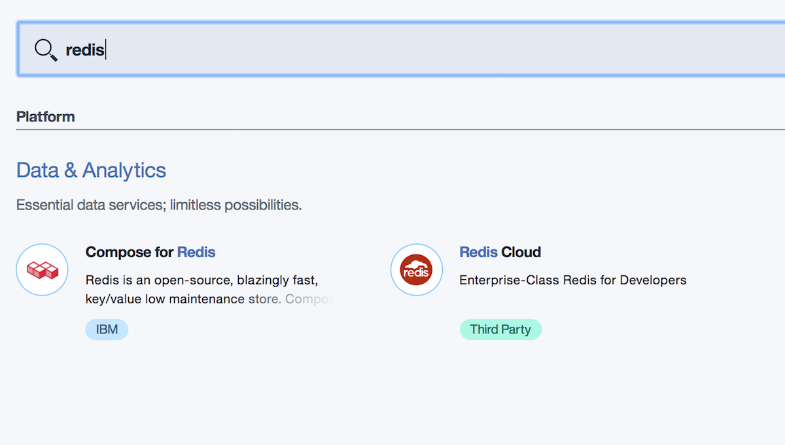

- Take note of the credentials, and save them in `scripts/kubernetes/secrets/service-credentials.txt`.

For Compose, the credentials can be found by selecting the service from the dasboard, and clicking "Service Credentials"

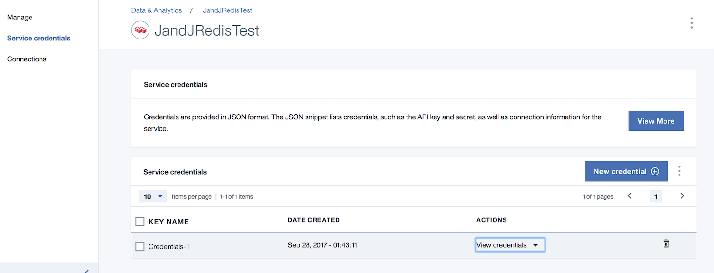

## Provision and bind a Memcached-as-a-Service
- You can do this with the `bx` command too, but I prefer to work with the dashboard as it's a one time setup operation with several options.
- Go to the hamburger navigation again and choose Data & Analytics.

    

- Click "Create"

    

- Choose Memcached from Redis Cloud.

    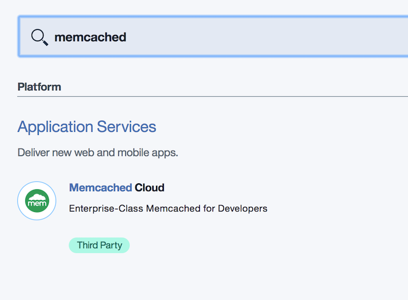

- Take note of the credentials, and save them in `scripts/kubernetes/secrets/service-credentials.txt`.
