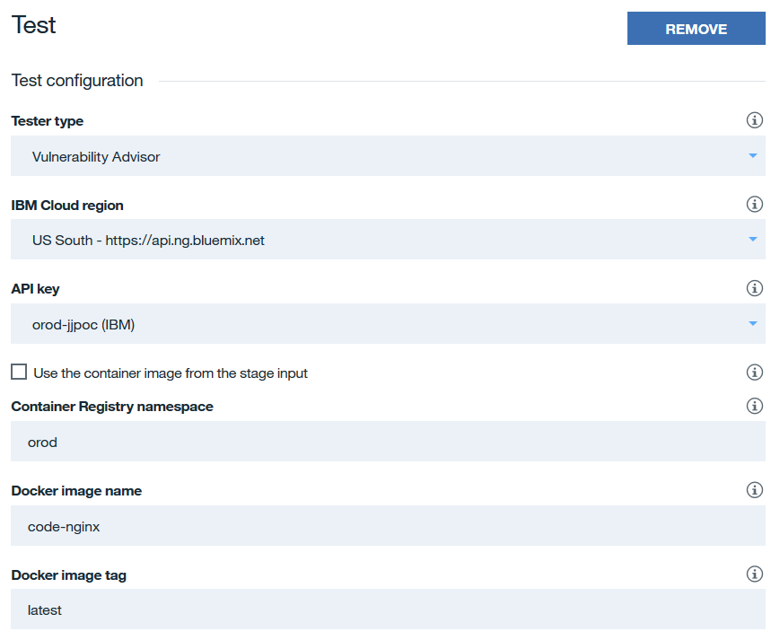
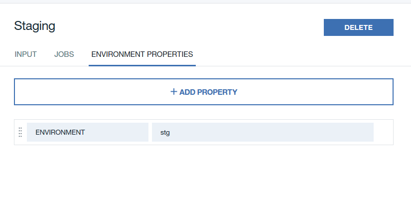

# Toolchain Introduction

This toolchain will enable your containers to automatically build and push to a registry as well as deploy to a Kubernetes cluster hosted on the IBM Cloud. This toolchain will be comprised of multiple pipelines, one for each major component of the cluster. Ideally there would be four different layers in build/deploy process:

  1. Push code to repository
  2. Check to see what directories have been changed
    - If config directory has been changed, rebuild base images and code layer
    - If code directory has been changed, only build the code layer
  3. Build images
  4. Test images with Vulnerability Advisor.
  5. Deploy to staging environment
  6. Deploy to production environment

Each of these layers could come from a different repository and could be built and deployed when code is pushed.

For the purpose of this POC, we have one repo that contains all of our images and custom code. Our finished toolchain will appear as follows:

  

# Building the Toolchain

1. To get started, click on the "hamburger" menu at the top left of Bluemix and select **Dev Ops**.

  

2. Click on Toolchains on the left pane
3. Click Create Toolchain
4. Scroll down to Other Templates and select **Build Your Own Toolchain**

  

5. Name toolchain and click **Create**
6. Click on **Add a Tool**

  

7. Click on **Git Repos and Issue Tracking**

  

8. Fill in details

  

  - Select Clone
  - Enter the URL to Dan's repo
  - Enter a Repository name (or not)
  - Make sure the **Track deployment of code changes** checkbox is checked. This will allow the pipeline to trigger automatically with code changes.
  - Click **Create Integration**
9. Add another tool
10. Select **Delivery Pipeline**

  
  
  - Name the pipeline **nginx**
  - Click **Create Integration**

11. Before moving on, we need to get an IBM Cloud API key. Click on **Manage** at the top right, hover over **Security** and select **IBM Cloud API keys**.

12. Click on **Create**, give your key a name and description, click Create.

13. Click *Show* and copy your API key. Make absolutely sure that you copied the key correctly because after you leave this page, you will not be able to see the key again.

14. Go back to your toolchain. You can get there by clicking on the menu at the top left, selecting **DevOps**, then selecting your toolchain from the list.

15. On the toolchain page, click on the Delivery Pipeline.

  

16. Click **Add Stage**

17. Make changes to **Input** tab.
  - Give stage a name
  - Ensure git URL and branch are correct
  - Ensure that **Run jobs whenever a change is pushed to Git** is selected. This will allow for the container images to build automatically.

    

18. Click on the **Jobs** tab. Click on **Add Job** and select **Build**.
  - Under *Builder Type* select **Container Registry**.
  - Under *API Key* see if your IBM Cloud API Key appears. If not, click on **Add an existing API Key** and enter the API key that you copied earlier.
  - For *IBM Cloud Container Registry namespace* enter **jjdojo**
  - In *Docker image name* enter **nginx**

  

  - In the *Build Script* section enter the following:
    ```bash
    echo "Calling the build script"
    cd scripts/pipeline
    . ./buildImage.sh
    ```
  - Leave the rest as it is and click on **Save** at the bottom of the stage.

19. Next, create another stage and name it **Test**. In this stage you can run any custom test scripts or use the built-in Vulnerability Advisor.

20. Click on the jobs tab, add a new job, and select **Test**.

21. Under *Tester Type*, select **Vulnerability Advisor**
  - Under *API Key* slect the key for your org or enter a new one
  - Under *Bluemix Container Registry Namespace* enter your Namespace
  - Select the *Docker Image Name* and *Docker Image Tag* that you want to test.
  - Add any additional testing scripts in the *Test Script* area.
  - When done, click *Save*

  

22. Once you are back on the pipeline page, click **Add Stage** again. Now we need to add our stage for deploying to the staging environemnt.

23. Name the stage **Staging** and make sure the input is coming from the previous build stage as seen below.

  

24. Next, click on the **Jobs** tab and click **Add job** and select **Deploy**.
  - For *Deployer Type* select **kubernetes**
  - Enter your API Key under *API Key*
  - Select the cluster that you would like to deploy to.
  - In the *Deploy Script* section, enter the following:

  ```bash
  #!/bin/bash

  . scripts/pipeline/pipelineDeployScripts/nginx-deploy.sh
  ```
  

  - Next we need to add an environment variable to tell the script which environment we are deploying to. Click on the *Environment Properties* tab.

  - Click *Add Property*, select *Text Property*, and under name enter **ENVIRONMENT** and under *Value* enter **stg**.

  

  - When done, click on **Save**

25. Next, we need to create another deployment stage but this time we will deploy to the production environment. Repeat steps **22 - 24** but this time, name the stage **Production**, and for the environment property, enter **prd**. The deploy script for both environments will be the same.

26. We should now have four stages in our nginx pipeline. This pipeline will handle the building, testing, and deploying of the nginx container in two different environments. We now need to add pipelines for our other containers. Click on the toolchain name at the top left of the page to take you back to the toolchain page.

  

27. Follow steps **14 - 25** to create pipelines for the other images while making sure to change the image names for the respective pipeline as well as making sure that the registry namespace and targeted cluster remains the same. Be sure to change the deploy script for each pipeline as follows:

  ---
  - **Note that php-cli does not need to be deployed into both environments**
  - For php-cli:
  ```bash
  #!/bin/bash

  . scripts/pipeline/pipelineDeployScripts/php-cli-deploy.sh

  ```

  ---
  - For php-fpm:
  ```bash
  #!/bin/bash

  . scripts/pipeline/pipelineDeployScripts/php-fpm-deploy.sh

  ```

  ---


28. Next, we need to add the step to build the persistent volumes. Create one more pipeline and name it **Persistent Volumes**

29. Click on it to configure the pipeline and add a new stage.

30. Add a new **Deploy** job, for *Deployer Type* select **Kubernetes**, enter your API Key, and select your target cluster.

31. For the in the *Deploy Script* section, enter the following:
  ```bash
  #!/bin/bash
  kubectl apply -f scripts/kubernetes/persistent-volumes.yaml
  ```

  

29. When done, click **Save**.

30. Now we just need to add one last pipeline that will allow us to manually run scripts to transfer files and data between environments. Click on the toolchain name at the top left to go back to the toolchain page.

31. Click *Add a Tool*
  - Select **Delivery Pipeline**
  - Name the pipeline **Data Sync**
  - Once the pipeline has been created, click on it to configure the stages.

32. Click *Add Stage* and name the stage **Transfer Files**
  - On the *Input* tab, change the *Stage Trigger* to *Run jobs only when this stage is run manually*

33. Click on the *Jobs* tab
  - Click *Add Job* and select *Deploy*
  - Name the job **Transfer Files**
  - Set the *Deployer Type* to **Kubernetes**
  - Verify the *API Key*, *Target*, and *Kubernetes Cluster*
  - For the *Deploy Script* enter the following:
    ```bash
    #!/bin/bash

    echo $(kubectl get pod -l "app=php-cli" -o jsonpath='{.items[0].metadata.name}')

    kubectl exec $(kubectl get pod -l "app=php-cli" -o jsonpath='{.items[0].metadata.name}') /root/drush/transfer-files.sh

    ```
    - Click *Save*
34. Add another stage
  - Name the stage **Transfer Data**
  - Click on the *Input* tab and set the *Stage Trigger* to **Run jobs only when this stage is run manually**

35. Click on the *Jobs* tab
- Click *Add Job* and select *Deploy*
- Name the job **Transfer Data**
- Set the *Deployer Type* to **Kubernetes**
- Verify the *API Key*, *Target*, and *Kubernetes Cluster*
- For the *Deploy Script* enter the following:
  ```bash
  #!/bin/bash

  echo $(kubectl get pod -l "app=php-cli" -o jsonpath='{.items[0].metadata.name}')

  kubectl exec $(kubectl get pod -l "app=php-cli" -o jsonpath='{.items[0].metadata.name}') /root/drush/transfer-data.sh

  ```
  - Click *Save*

30. Our toolchain is now configured and should look similar to the image below:

  

All that we have to do now is push a change to our repo to automatically kick off the pipeline.
